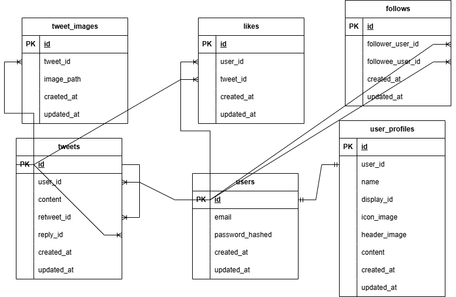

# twitter-clone-server

このプロジェクトでは、以下のER図に基づいてデータベースを設計しています。

## ER図


- Draw.ioファイルは[こちら](./docs/twitter-clone-ER.png)

## API設計

### タイムラインのツイートを取得
`GET api/tweets/timeline?cursor...=&limit=...`
#### レスポンス例
※リプライはタイムラインに流れない
```json
{
  {
    "id": 1,
    "user": {
      "id": 2,
      "display_id": "hoge",
      "name": "hoge",
      "icon_url": "...",
    },
    "content": "これはリツイート",
    "retweet": {
      "id": 101,
      "user": {
        "id": 5,
        "display_id": "fuga",
        "name": "fuga",
        "icon_url": "..."
      },
      "content": "これはリツイートされたツイート",
      "interactions": {
        "retweet_count": 3,
        "reply_count": 6,
        "like_count": 7,
      }
      "created_at": "2022-11-05",
    },
    "interactions": {
      "retweet_count": 5,
      "reply_count": 4,
      "like_count": 5,
    }
    "created_at": "2024-12-11",
  },
  {
    ...
  }
}
```

### フォローしている人だけのTweetを取得
`GET api/tweets/follow?cursor=...&limit=...`

レスポンスはタイムラインのツイート取得と同じ

### あるユーザーのツイートを取得
`GET api/users/:id/tweets?cursor=...&limit=...`

これも上と同じ

### あるidのツイートを取得
`GET api/tweets/:id`

レスポンス例
```
{
  "id": 3,
  "user": {
    ...
  },
  "content": "this is tweet",
  "interactions": {
    ...
  },
  "created_at": "...",
}
```

### あるツイートの詳細(リプライ)を取得
`GET api/tweets/:id/replys
```json
{
  {
    "id": 1,
    "user": {
      ...
    },
    "content": "これはリプライ",
    "interactions": {
      ...
    },
    "created_at": "",
  },
  {

  }
}
```

### ツイートする
`POST api/tweet`

リクエスト例
```json
{
  "content": "ツイート",
}
```

### リツイートする
`POST api/tweet/:id/retweet`

リクエスト例
```json
{
  "content": "リツイート",
  "retweet_id": 3,
}
```

### リプライする
`POST api/tweet/:id/reply`

```json
{
  "content": "リプライ",
  "reply_id": 4,
}
```
